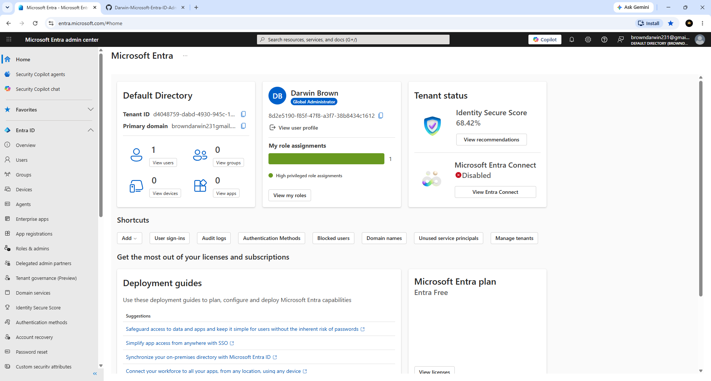
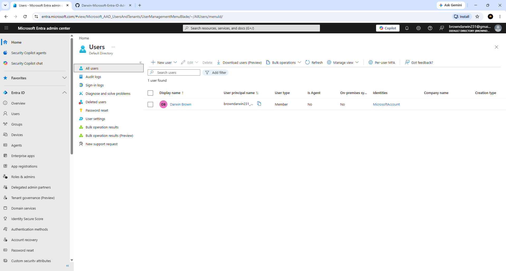
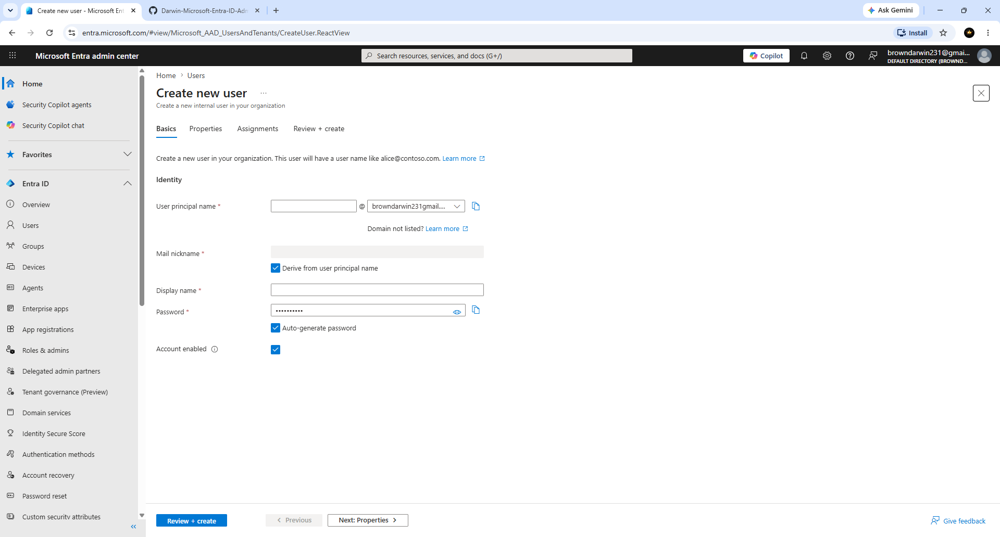
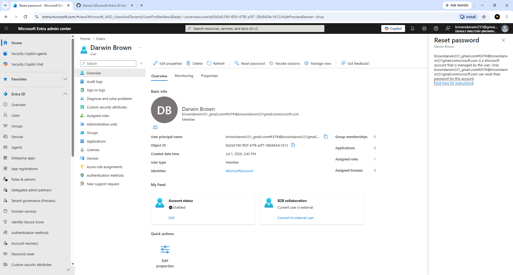
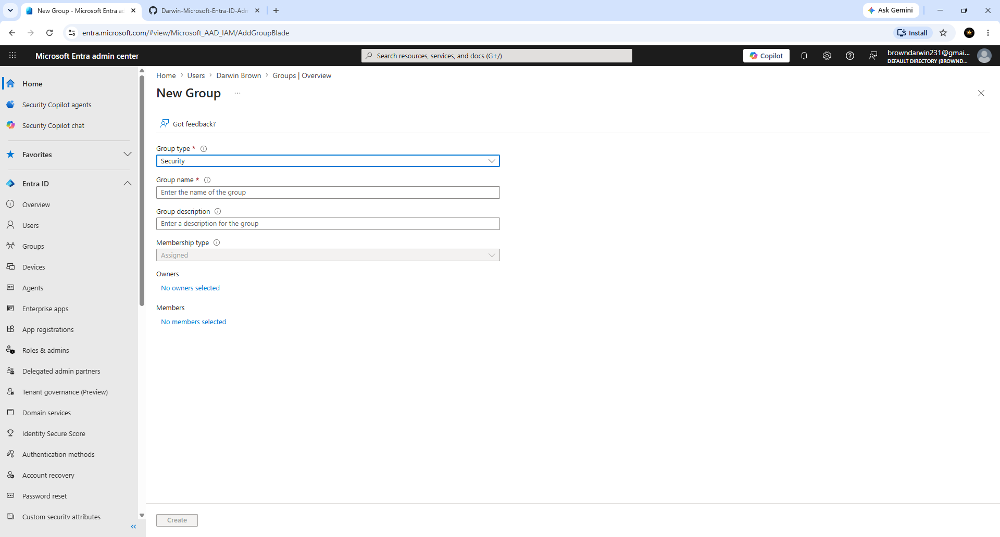
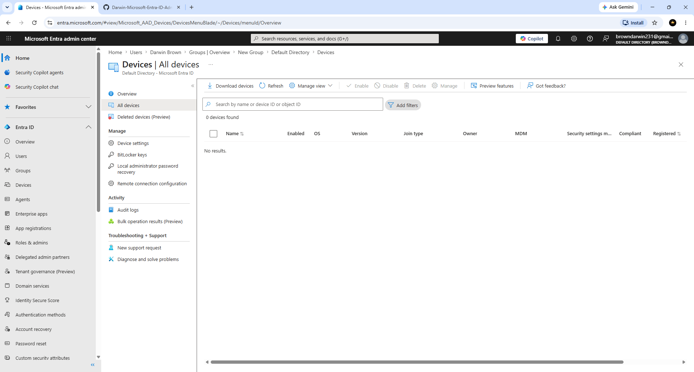
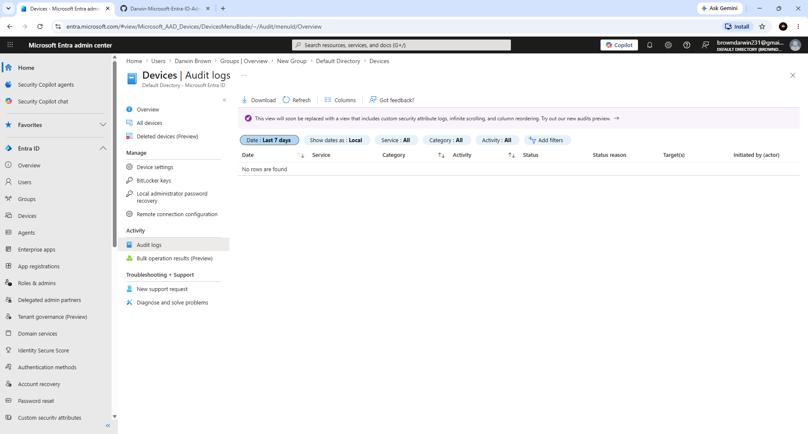
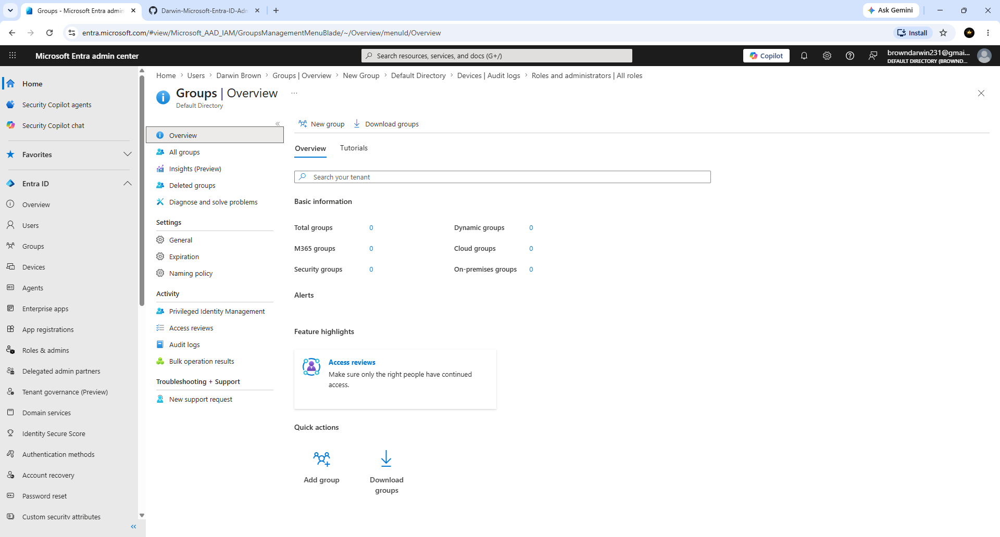

# Darwin-Microsoft-Entra-ID-Administration-Lab
Hands-on Microsoft Entra ID administration lab demonstrating user management, groups, password reset, MFA, Conditional Access, and identity security using Microsoft Entra ID.

Hands-on Microsoft Entra ID administration lab demonstrating user management, group management, password reset, multifactor authentication (MFA), Conditional Access, identity security, and access management in a cloud environment.

---

## Objectives

- Manage Microsoft Entra ID users
- Create and manage security groups
- Create Microsoft 365 groups
- Assign licenses
- Reset user passwords
- Enable Multifactor Authentication (MFA)
- Configure Conditional Access policies
- Assign administrator roles
- Review sign-in logs
- Review audit logs
- Manage guest users
- Explore identity security features

---

## Skills Demonstrated

- Microsoft Entra ID Administration
- Identity and Access Management (IAM)
- User Account Administration
- Group Management
- Password Management
- License Administration
- Multifactor Authentication (MFA)
- Conditional Access
- Security Monitoring
- Audit Log Review
- User Provisioning
- Cloud Administration

---

# Lab Walkthrough

## 1. Microsoft Entra Admin Center Dashboard

Reviewed the Microsoft Entra Admin Center dashboard and explored identity management features.

**Screenshot**

---

## 2. User Management

Viewed existing users and explored user account management.

**Screenshot**

---

## 3. Create New User

Created a new Microsoft Entra ID user account.

**Screenshot**

---

## 4. Password Reset

Performed a password reset for a user account.

**Screenshot**

---

## 5. Security Group

Created and managed a Security Group.

**Screenshot**

---

## 6. Microsoft 365 Group

Created a Microsoft 365 Group for collaboration.

**Screenshot**

---

## 7. Multifactor Authentication (MFA)

Configured Multifactor Authentication for user accounts.

**Screenshot**

---

## 8. All Devices

Created a Conditional Access policy to improve security.

**Screenshot**

---

## 9. Device Settings

Reviewed Microsoft Entra sign-in logs for authentication events.

**Screenshot**

---

## 10. Audit Logs

Reviewed audit logs to monitor administrative activities.

**Screenshot**

---

## 11. Roles and administration

Assigned an administrative role to a user.

**Screenshot**

---

## 12. Groups Overview

Invited and managed an external guest (B2B) user.

**Screenshot**

---

# Technologies Used

- Microsoft Entra ID
- Microsoft 365
- Azure Portal
- Microsoft Admin Center
- Identity and Access Management (IAM)
- Conditional Access
- Multifactor Authentication (MFA)

---

# Key Skills

- Cloud Identity Management
- User Administration
- Group Administration
- Access Control
- Identity Security
- Microsoft Entra ID
- Microsoft 365 Administration
- Password Reset
- User Provisioning
- Security Administration
- Cloud Administration
- Help Desk Support

---

# Outcome

Successfully completed a hands-on Microsoft Entra ID administration lab demonstrating practical experience with cloud identity management, user administration, authentication, access control, and Microsoft 365 security features commonly used by Help Desk, System Administrator, and SOC Analyst professionals.
